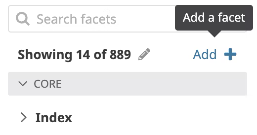
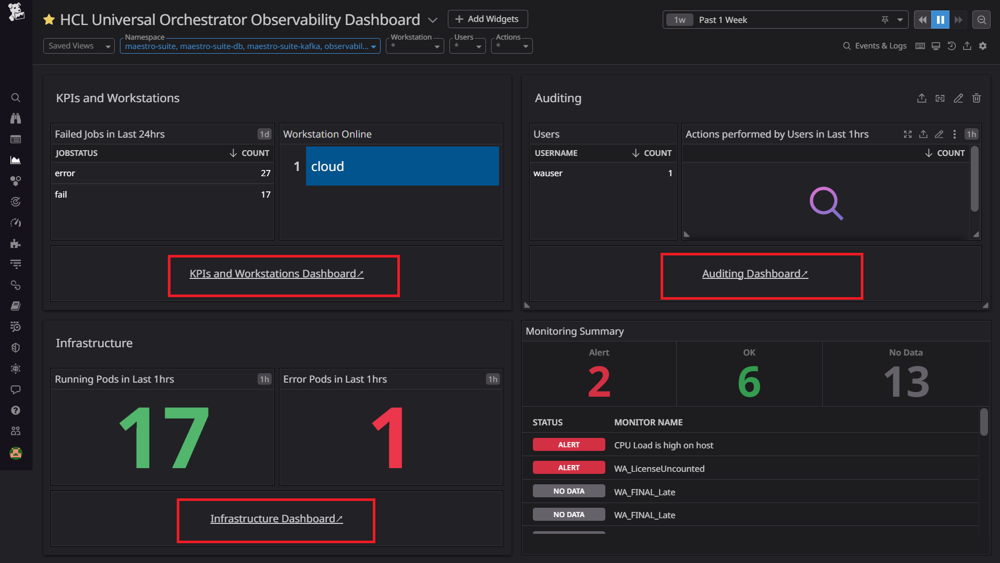
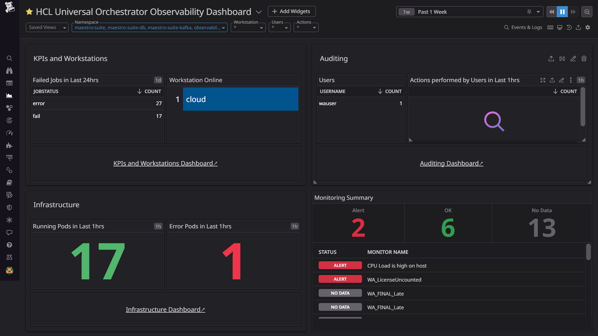
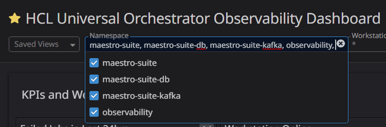

# HCL Universal Orchestrator Observability for Datadog

You can use HCL Universal Orchestrator (UnO) Observability for Datadog to monitor HCL Universal Orchestrator metrics, events, audit and infrastructure logs.

## Content
- [HCL Universal Orchestrator Observability for Datadog](#hcl-universal-orchestrator-observability-for-datadog)
  - [Content](#content)
  - [Prerequisites](#prerequisites)
  - [Language support](#language-support)
  - [Installation](#installation)
    - [1. Installating and configuring Datadog](#1-installating-and-configuring-datadog)
    - [2. Datadog installation](#2-datadog-installation)
    - [3. Forwarding Logs to Datadog](#3-forwarding-logs-to-datadog)
    - [4. Forwarding Metrics to Datadog](#4-forwarding-metrics-to-datadog)
  - [UnO Monitoring Dashboards and Alerts setup in Datadog](#uno-monitoring-dashboards-and-alerts-setup-in-datadog)
    - [1. Create Log Facets](#1-create-log-facets)
    - [2. Create Dashboards and Monitors](#2-create-dashboards-and-monitors)
    - [3. Configuring dashboard markdown link](#3-configuring-dashboard-markdown-link)
  - [Getting Started with Universal Orchestrator Monitoring](#getting-started-with-universal-orchestrator-monitoring)
  - [FAQs](#faqs)

## Prerequisites
Following prerequisites must be satisfied prior to deploy the Datadog solution: 
- Kubernetes cluster (GKE) with administrative access
- UnO v1.1 installed on the Kubernetes cluster 
- Tools & Packages 
  - Datadog Agent v7 and Datadog release 3.3.1

## Language support
For the dashboards provided with UnO Observability for Datadog, the only supported language is English. 

## Installation


### 1. Installating and configuring Datadog
1. From [HCL License Portal](https://id.hcltechsw.com/login/login.htm) download the appropriate HCL Universal Orchestrator Observability installation package:
   Universal Orchestrator for UnO Observability Add-on
   
2.  Installation package for Datadog: UNO_OBSERVABILITY_APP_FOR_DATADOG_1.1.0.0.tar.gz

3. Follow the below command to untar the gzip file 
  
  ```
	tar -xvzf UNO_OBSERVABILITY_APP_FOR_DATADOG_1.1.0.0.tar.gz
  ```

4. Follow the steps mentioned on this ReadMe file to complete the solution setup.

### 2. Datadog installation

1. To install the Datadog agent on your cluster, follow this procedure: [Datadog Agent on Kubernetes](https://docs.datadoghq.com/containers/guide/kubernetes_daemonset/).
2. At step 2, Download this [datadog-agent.yaml](https://github.com/DataDog/documentation/blob/ec93cab1dec4f642a45bb712c3f3d690f096ffe0/static/resources/yaml/datadog-agent-all-features.yaml) file.
3. Continue with step 3 and 4 installation.
4. At step 5, if your Datadog site to datadoghq.com skip this step, otherwise set DD_SITE based on your Datadog website URL.

    Follow this [documentation site selector](https://docs.datadoghq.com/getting_started/site/#access-the-datadog-site) and select the site parameter based on your Datadog website URL.

    Look at this command below as an example.
    ```
     - name: DD_SITE
       value: "{ADD_SITE_PARAMETER}"
    ```
      Inside datadog-agent.yaml you will find daemonset.yaml section and then add the following environment variable to agent container.

5. Before executing step 6, configure your YAML file for Forwarding metrics and logs steps as mentioned below.

### 3. Forwarding Logs to Datadog

Inside daemonset.yaml, add the following environment variable for agent container:

```
 - name: DD_KUBELET_TLS_VERIFY
   value: "false"
 - name: DD_CONTAINER_INCLUDE_LOGS   
   value: "container_name:audit-log-sidecar"           
 - name: DD_CONTAINER_INCLUDE
   value: "kube_namespace:maestro-suite kube_namespace:maestro-suite-db kube_namespace:maestro-suite-kafka kube_namespace:observability"
 - name: DD_CONTAINER_EXCLUDE
   value: "kube_namespace:.*"
 - name: DD_CONTAINER_EXCLUDE_LOGS
   value: "container_name:.*"
```

Inside daemonset.yaml, add the following environment variable for following containers ( trace-agent,process-agent,system-probe,security-agent ).
```
 - name: DD_KUBELET_TLS_VERIFY
   value: "false"
 - name: DD_CONTAINER_INCLUDE
   value: "kube_namespace:maestro-suite kube_namespace:maestro-suite-db kube_namespace:maestro-suite-kafka kube_namespace:observability"
 - name: DD_CONTAINER_EXCLUDE
   value: "kube_namespace:.*"
  ```
Update the kube_namespace in DD_CONTAINER_INCLUDE environment value,Once the namespace of the UnO is changed.

### 4. Forwarding Metrics to Datadog

Inside daemonset.yaml, add the following environment variable for agent container:
```
  - name: DD_PROMETHEUS_SCRAPE_CHECKS
    value: "[{\"autodiscovery\":{\"kubernetes_annotations\":{\"exclude\":{\"prometheus.io/scrape\":\"false\"},\"include\":{\"prometheus.io/path\":\"/q/metrics\",\"prometheus.io/scrape\":\"true\"}}},\"configurations\":[{\"openmetrics_endpoint\":\"https://%%host%%:%%port%%/q/metrics\",\"namespace\":\"uno_metrics\",\"tls_verify\":false}]}]"                  
```

Note: Add property "tls_verify":"false" for not certified or unsecure metrics endpoint.

Inside daemonset.yaml, add the following environment variable for agent container:

```
 - name: DD_PROMETHEUS_SCRAPE_ENABLED
   value: "true"  
 - name: DD_PROMETHEUS_SCRAPE_VERSION
   value: "2" 
```

After you have configured your YAML file, continute with steps 6 and 7 mentioned in the procedure: [Datadog Agent on Kubernetes](https://docs.datadoghq.com/containers/guide/kubernetes_daemonset/).

NOTE : This Datadog version is monitoring all the namespace in the cluster.So add your namespaces in the filter to see your namespace related information.

## UnO Monitoring Dashboards and Alerts setup in Datadog

### 1. Create Log Facets


Navigate to Logs > Search page and locate Add button on the left side below the search facet , Create a new facet directly from the facet panel using the add facet button and create Log factes for the below attributes.
| Attributes	|
| ------ | 
| @actionType	|
| @userName	|
| @objectType	|

### 2. Create Dashboards and Monitors
Run the starter.sh with your DD_HOST_PATH,DD_API_KEY, DD_APP_KEY as parameters. 

```
 $ sh ./starter.sh DD_HOST_PATH DD_API_KEY DD_APP_KEY 
```

Look at this command below as an example.

```
 $ sh ./starter.sh  https://XXX.datadoghq.com 934ac4513XXXXXXX 0efa7dc64XXXXXXX 
```

### 3. Configuring dashboard markdown link

The UnO Observability **Overview Dashboard**​ provides the link to all dashboards. Once the dashboard is created, a new dashboard id is generated for each and every dashboard. So every dashboard id needs to be updated on the UnO Observability Dashboard​ markdown component.



1. In Dashboard List, open each and evey dahboard in a new window and copy the dashboard URLs.
2. Select UnO Observability Dashboard.
3. Edit all markdown components as mentioned above.
4. Replace your respective dashboard URLs with markdown field. 

## Getting Started with Universal Orchestrator Monitoring     

The UnO Monitoring Overview Dashboard provides a single, consolidated view for monitoring the workload status. By selecting a dashboard on the list, you can see the information related to that dashboard. 

**UnO Monitoring Overview Dashboard** 

In the UnO Monitoring Overview Dashboard, you can view the whole status of your workload at a glance for one or more of the engines you have configured.  

**Overview Dashboard**: 
 

By clicking a button or menu option, you open a new tab displaying the selected dashboard information. The following dashboards are supported: 

- **KPIs and Workstations Dashboard**. This dashboard shows the Universal Orchestrator KPIs information for each host and allows drilldown to see the timeseries data in visual representation for defined KPIs.

  Source of Information : API exposed by all the pods on port 8443.
   
- **Auditing Dashboard**. This dashboard shows details of workstations and audit information such as user actions. Users can view audit information for selected time range, user and object. 

  Source of Information:  UnO sidecar audit containers, for example: audit-log-sidecar. 

- **Infrastructure Dashboard**. This dashboard provides an overview of the infrastructure details of Universal Orchestrator deployed on Kubernetes cluster. Filter by your Kubernetes namespace and view the dasboard as shown below:

  

  Source of Information: Infrastructure Logs exposed by kubernetes cluster. 

- **Monitors**: Monitors are created out of UnO Monitoring Application. Follow this [Monitors](https://docs.datadoghq.com/monitors/) documentation to create your monitors and alerts. The following table shows some of the out-of-the-box monitors that come with the UnO Observability Dashboard:

| Monitors	 | Threshold Condition | Priority |
| ------ | ------ | ------ | 
| Uno_Agent_Linked  |	==0 (more than 5 minutes  ) | Critical |


## FAQs


1. Q: What is the minimum characters need to create Random string?

   A: The random string must contain at least 32 alphanumeric characters without space.
    
2. Q: Where to find daemonset.yaml ?

    A: The downloaded datadog-agent.yaml file consist of multiple yaml files. You can find daemonset.yaml section inside the datadog-agent.yaml file.
    
3. Q: How many dashboards are available with Universal Orchestrator Observability for Datadog?

    A: You can import and use the following dashboards:
  
    - UnO Observability Dashboard​ (Overview Dashboard)
    - KPIs and Workstations Dashboard
    - Auditing Dashboard
    - Infrastructure Dashboard
 
4. Q: How to apply Dark theme to Datadog dashboards?

   A: View Datadog dashboards in dark mode by hovering over your avatar in the sidebar, or by pressing Ctrl+Opt+D / Ctrl+Alt+D.
    
5. Q: Which version of Datadog is supported?

    A: The solution supports and was verified on Datadog Agent v7 and Datadog release 3.3.1.
    
6. Q: Where to view the ingested metrics and logs after integration is done ?
   
    A: Follow the below Navigation
    - Metrics : In Menu > Metrics > Summary
    - Logs    : In Menu > Logs > Search
    
7. Q: How to save the filter history?

    A: Add your filter keys and select "save select view as". Then, add the view name. 
     
8. Q: How can I filter information on dashboards ?

    A: There is a filter on each dashboard.You can use these suggestions and give specific input to the filter.   
     
     

9. Q: How to collect metrics from not certified or unsecure metrics endpoint?

   A: Add property "tls_verify":"false" to the metric instances.

10. Q: How to create Application Key?

    A: To add a Datadog application key:
    
    - In your Profile , Navigate to Organization Settings > Application Keys.
    - If you have the permission to create application keys, click New Key.

    Notes: Application key names cannot be blank.

11. Q: How to create API key ?

    A: To add a Datadog API key or client token:

    - In your Profile , Navigate to Organization settings, then click the API keys or Client Tokens tab.
    - Click the New Key or New Client Token button, depending on which you’re creating.
    - Enter a name for your key or token.
    - Click Create API key or Create Client Token.
   
    Notes: Your org must have at least one API key and up to 50 API keys. Key names must be unique across your organization. 

12. Q: How to create new alerts/monitors ?

     A: Follow this [Monitors](https://docs.datadoghq.com/monitors/) documentation to create your alerts/monitors.
            
13. Q: Error while getting hostname, exiting: unable to reliably determine the host name. You can define one in the agent config file or in your hosts file.
     
    A:  Inside its manifest daemonset.yaml, add the following environment variable for all containers ( agent, trace-agent,process-agent,system-probe,security-agent ).
    
    ```
         - name: DD_KUBELET_TLS_VERIFY
           value: "false"
    ```
    
14. Q: How to view logs on Auditing Dashboard piechart component ?
    
     A: Select the pie chart and select the View related logs.
    

    
